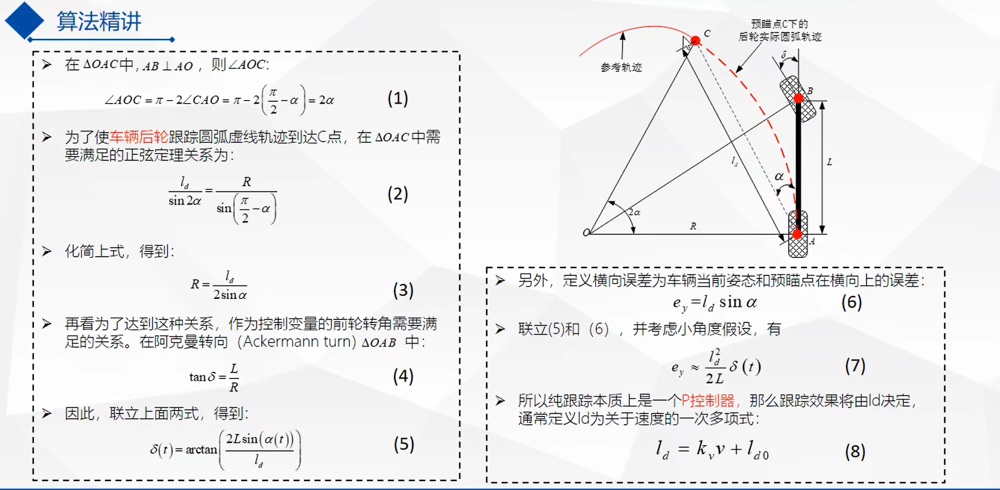
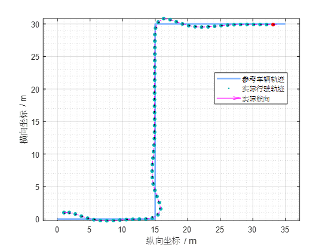
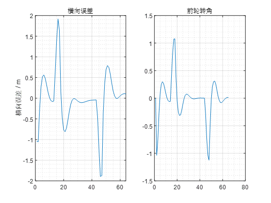
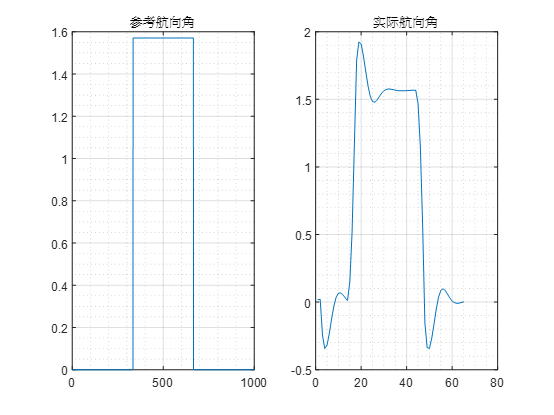

# Pure_pursuit

## 1. 绪论

算法参考：[Pure_Pursuit算法 BiliBili](https://www.bilibili.com/video/BV1Ly4y177dF/?spm_id_from=333.1391.0.0&vd_source=c322f5c4214247dc01792a73080a62b9)

程序参考：[Pure_Pursuit算法 Github](https://github.com/Pengskr/Pure-Pursuit)

特点：

- 以车的后轴中心为基点，通过控制前轮的偏角`delta`，使车辆沿一条经过预瞄点的**圆弧**行驶。
- 跟踪效果将由`ld`决定，如何设计`ld`也是算法的改进方向之一。
- 预瞄点的引入使得控制更加平顺，普通PID控制跟踪的是离车辆最近的轨迹点，而**纯跟踪法跟踪的是预瞄点**。
- 纯跟踪本质是一个**P控制器**，对车辆进行**横向控制**。

---

## 2. 效果展示

### 2.1 Z型路径追踪

追踪效果：

控制效果：

航向控制：

---

